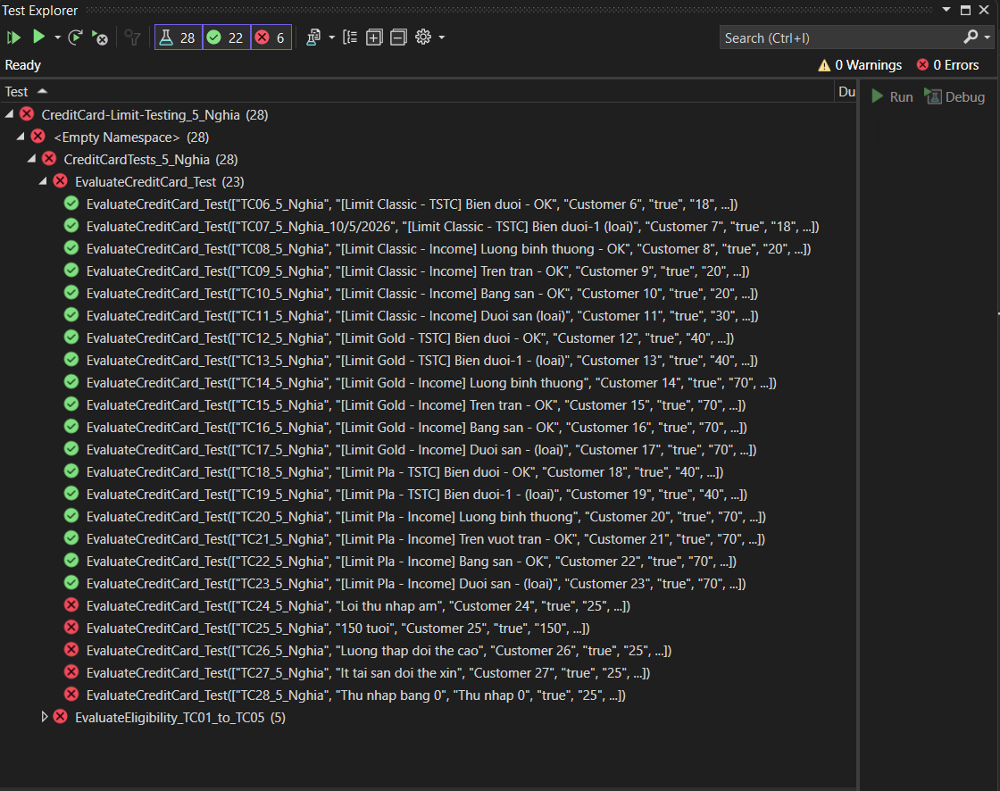
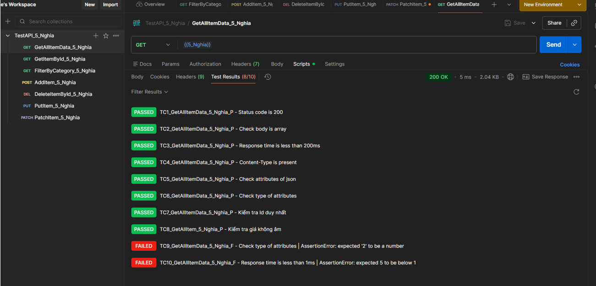
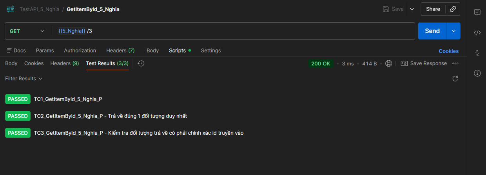
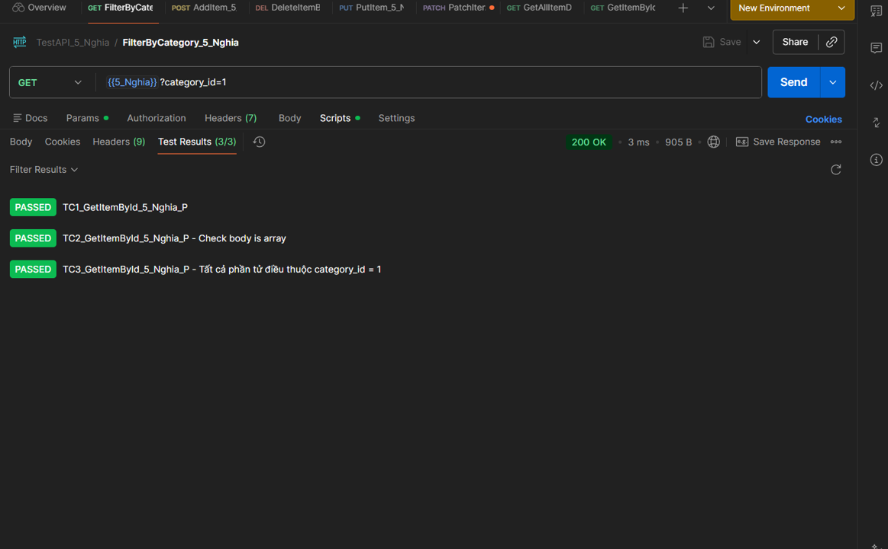
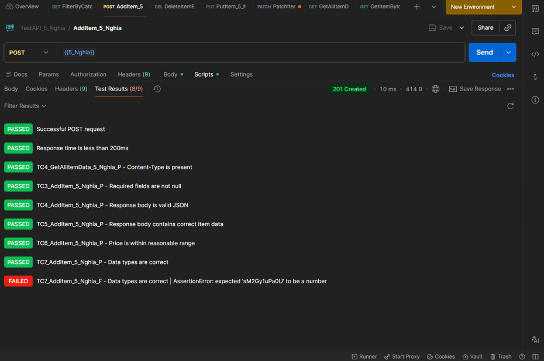
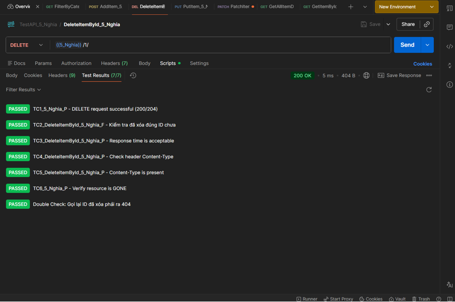
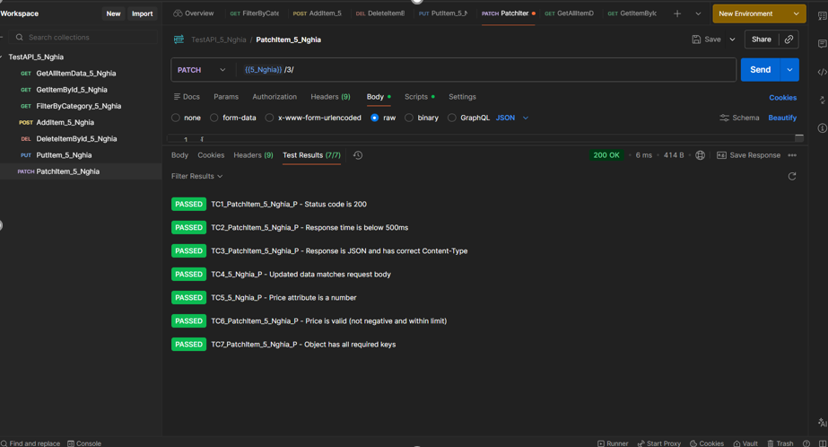

## 1. Giới thiệu (Overview)

Dự án này chứa module core logic **`CreditService_5_Nghia`** thực hiện xử lý thẩm định và phê duyệt hạn mức thẻ tín dụng dựa trên các quy định nghiệp vụ (Business Rules) của ngân hàng. Đi kèm với service là bộ mã nguồn **Unit Test** sử dụng framework **NUnit** áp dụng phương pháp **Data-Driven Testing** để tự động hóa việc kiểm thử chất lượng code thông qua file cấu hình dữ liệu đầu vào.

## 2. Công nghệ sử dụng (Tech Stack)

- **Ngôn ngữ:** C# (.NET Core / .NET Framework)

- **Testing Framework:** NUnit 3+

- **Test Runner:** Visual Studio Test Explorer

- **Phương pháp kiểm thử:** Data-Driven Testing (Đọc dữ liệu từ file CSV) và Parameterized Testing (`[TestCase]`)

## 3. Định nghĩa Logic Nghiệp vụ (Business Rules)

Hàm `EvaluateACB_5_Nghia` tiếp nhận thông tin khách hàng và hạng thẻ mong muốn để đưa ra quyết định dựa trên các quy tắc sau:

### 3.1. Điều kiện tiên quyết (Eligibility)

Khách hàng được duyệt phải thỏa mãn đồng thời:

- Là người Việt Nam (`IsVietnamese_5_Nghia == true`)

- Tuổi từ $18$ đến $70$

- Nhóm CIC thuộc nhóm $1$ hoặc $2$ (Không có nợ xấu lịch sử)

### 3.2. Công thức tính hạn mức thô (Raw Limit)

- **Qua thu nhập (By Income):** $\text{Hạn mức thô} = \text{Thu nhập} \times 3$

- **Qua tài sản thế chấp (By Asset):** $\text{Hạn mức thô} = \text{Giá trị tài sản} \times 0.8$

### 3.3. Phân hạng và Chặn trần/sàn (Card Tier Clamping)

| **Hạng Thẻ (Requested Tier)** | **Điều kiện Hạn mức tối thiểu (Sàn)** | **Hạn mức tối đa áp dụng (Trần)** |
| ----------------------------- | ------------------------------------- | --------------------------------- |
| **Classic**                   | $\ge 10,000,000$ VND                  | Tối đa $49,999,999$ VND           |
| **Gold**                      | $\ge 50,000,000$ VND                  | Tối đa $499,999,999$ VND          |
| **Platinum**                  | $\ge 500,000,000$ VND                 | Tối đa $1,000,000,000$ VND        |

## 4. Cấu trúc Bộ Kiểm Thử (Test Suite Structure)

Bộ kiểm thử được chia thành 2 phần chính để tối ưu hóa việc quản lý:

### 4.1. Kiểm thử điều kiện đầu vào đầu biên (`TC01` $\rightarrow$ `TC05`)

Sử dụng các thuộc tính `[TestCase]` trực tiếp trong code để kiểm tra nhanh các trường hợp khách hàng bị từ chối ngay từ vòng lọc hồ sơ (Hồ sơ nước ngoài, dưới 18 tuổi, quá 70 tuổi, CIC sai quy định).

### 4.2. Kiểm thử dữ liệu động qua CSV (`TC06` $\rightarrow$ `TC28`)

Hàm `EvaluateCreditCard_Test` sử dụng `[TestCaseSource(nameof(GetTestData))]` để nạp dữ liệu động từ file `TestData_5_Nghia.csv`.

- **Vị trí file dữ liệu:** `Data_5_Nghia/TestData_5_Nghia.csv`

- **Nhiệm vụ:** Kiểm tra giá trị biên dưới (Biên - 1), biên trên, tính toán hạn mức chính xác cho từng hạng thẻ, và phát hiện các trường hợp dữ liệu bất thường (âm tiền, sai lệch yêu cầu).

## 5. Hướng dẫn Chạy Test (Execution Guide)

1. Mở giải pháp (Solution) bằng **Visual Studio**.

2. Đảm bảo file dữ liệu `TestData_5_Nghia.csv` đã được thiết lập thuộc tính `Copy to Output Directory` là **Copy if newer** hoặc **Copy always** để chương trình test có thể tìm thấy file trong thư mục `bin`.

3. Mở cửa sổ **Test Explorer** (`Test` > `Test Explorer`).

4. Nhấn nút **Run All** (hoặc dùng tổ hợp phím `Ctrl + R, A`).

5. Kết quả hiển thị xanh (Pass) toàn bộ 22/28 test cases thành công

## 5. Kết quả

# II. Selenium WebDriver Test - WallpaperAlchemy

## 1. Description

Automated UI testing for WallpaperAlchemy using Selenium WebDriver (C#).

## 2. Tech Stack

- C#
- .NET Framework
- Selenium WebDriver
- ChromeDriver
- Windows Forms

## 3. Test Features

- Login
- Upload image
- Download image
- Search wallpaper
- Delete wallpaper

## 4. Test Cases

| Feature  | Positive | Negative |
| -------- | -------- | -------- |
| Login    | ✅        | ✅        |
| Upload   | ✅        | ✅        |
| Download | ✅        | ✅        |
| Search   | ✅        | ✅        |
| Delete   | ✅        | ✅        |

# III. API Testing with Postman

REST API testing project using Postman with automated JavaScript test scripts.

## 1. Features

- CRUD API testing (GET, POST, PUT, PATCH, DELETE)
- Response validation
- Status code & response time checks
- JSON schema and data type validation
- Business rule validation
- End-to-end workflow testing

## 2. Tech Stack

- Postman
- JavaScript
- REST API

## 3. Run

1. Import `TestAPI.postman_collection.json`
2. Configure the `{{5_Nghia}}` environment variable.
3. Run the collection using Postman Collection Runner.

## 4. Kết quả

### 4.1. Get

## 4.2. Post

## 4.3. Delete

## 4.4. Patch

## 4.5. Put

